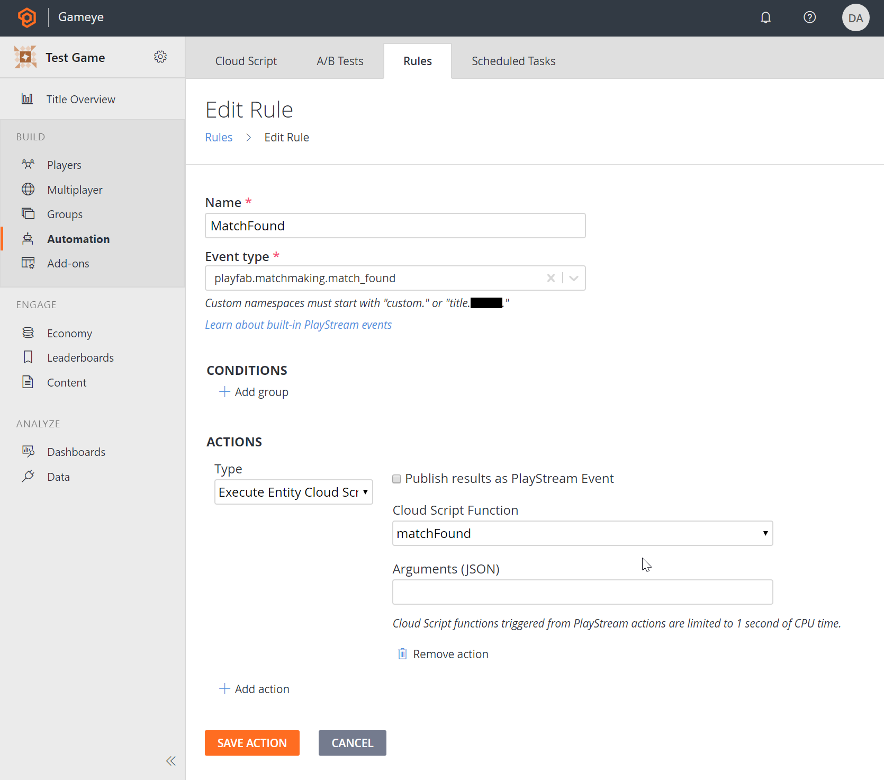
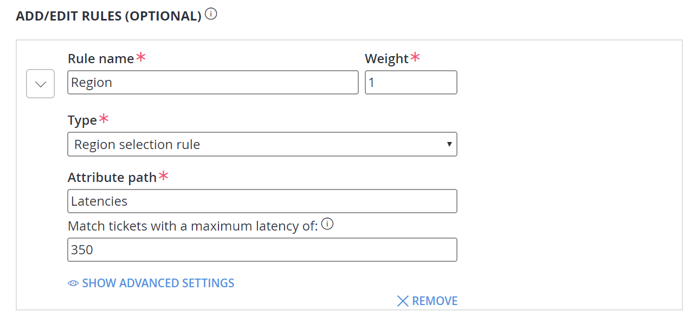
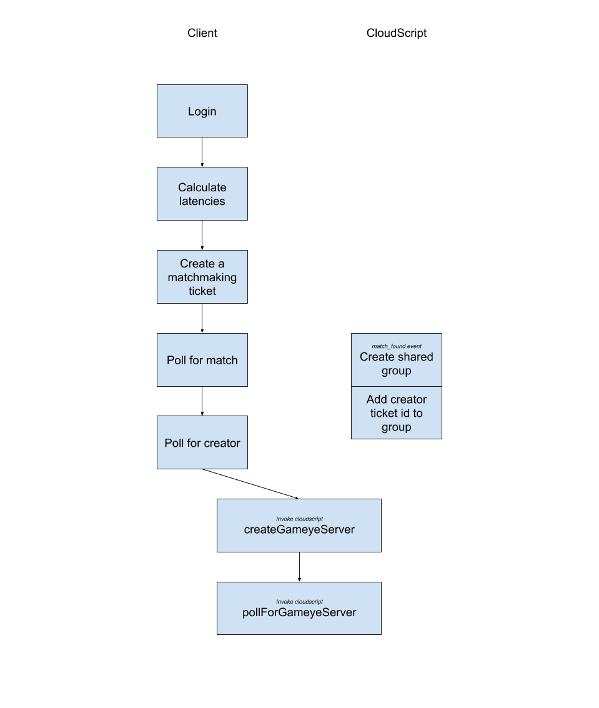

# Gameye Playfab Integration

## Intro
This integration describes how to use Gameye game server hosting in combination with Playfab matchmaking and player data storage for your multiplayer game.

## Requirements
- Making use of Playfab matchmaking v2
- Entity events v2 must be enabled for the correct Title ID in your account.

## Contents

- Example NodeJS game client in `client`
- Example CloudScript for starting a gameye match in `cloudscript`

### CloudScript

In the cloudscript folder is a cloud script that communicates with the Gameye servers and provides information back to the game client.

#### Usage

- In the PlayFab admin panel, go to Content and add your Gameye access token and the Gameye API URL to the Title Internal Data. These will be hidden from the client, but are needed by the cloud script.

- In Automation -> Cloud Script -> Revisions, copy the content of `script.js`, save and deploy.

- Under Rules, create a new Rule that responds to the event `playfab.matchmaking.match_found`. - Add an Action that executes the cloud script function `matchFound`.

- Under Multipler -> Matchmaking create a queue with the desired settings for the game. If you wish to take advantage of the region settings, add a Region Selection Rule to the queue which uses the Latencies attribute. In our example, we've set the Max Latency to 350ms, but this could be changed accordingly. Be careful not to set this too low, as matches might not be made, and no Region Preference will be determined.

### Game Client

- In the client folder is an example NodeJS client using the PlayFab SDK.
- Run `npm install`
- Modify the `constants.ts` updating the TitleId and QueueName to match the details from the PlayFab admin panel. Update the Gameye constants with values for the game running on Gameye servers. The example provided is for a CS:Go Bot Match.
- Run `npm run compile`
- Run `node ./node/program.js USER_ID` in mutliple terminals/devices with different values for USER_ID. This will create multiple matchmaking tickets, which should then be matched together in the correct region.

## Flow Explanation

- PlayFab requires a logged in user. In the example, a custom id is used, but any type of login should work. The result is only used for matchmaking, and this is not personal identifiable information.

- Latencies are calculated by pinging the PlayFab QoS beacons on port 3075. These latencies are put into the matchmaking request.

- A matchmaking ticket is created, and PlayFab servers are polled until a response comes back. The response contains the `MatchId`, which is used for data storage in cloudscript and as a `matchKey` for the Gameye servers.

- The Cloudscript creates a shared group with the `MatchId` as an identifier. Clients then poll for this group, to find out which client should start the match. Note that the TicketId is used here instead of trying to identify the user.

- The chosen client issues a call to cloudscript directly to start a Gameye match with the given match information.

- Both clients then poll cloudscript for a Gameye server with the correct `matchKey` to become available.

- Once the Gameye server is available, the host information can be extracted and clients can use this to connect.

## Playfab Settings

*Do I need to enable "Server allocation"on my queue?*
No, this activates Playfab's own server solution which isn't needed when using Gameye.

*Using multiple queues*
Playfab v2 matchmaking is a general matchmaking queue system. If you want to match with the same game mode, you'll need a queue for that mode. Our example only uses one queue, but it's not hard to add multiple. In our example the queue is a constant, not a parameter in the matchmaking, you can make it a paramater and allow the client to specify it on the API call.

## Notes

- The reason for triggering the game servers via a cloudscript execution are two-fold. Firstly, the free-tier timeouts in cloudscript event rules are too short to create a game server. These limits do not apply when using Azure functions. Secondly, by doing them in cloudscript, we obscure the token and gameye server urls from the client, preventing malicious users from abusing a token.

- Compilation may throw some Typescript errors relating to not finding some PlayFab namespaces. This can safely be ignored, as the classes are available, but the typings use a legacy method.
