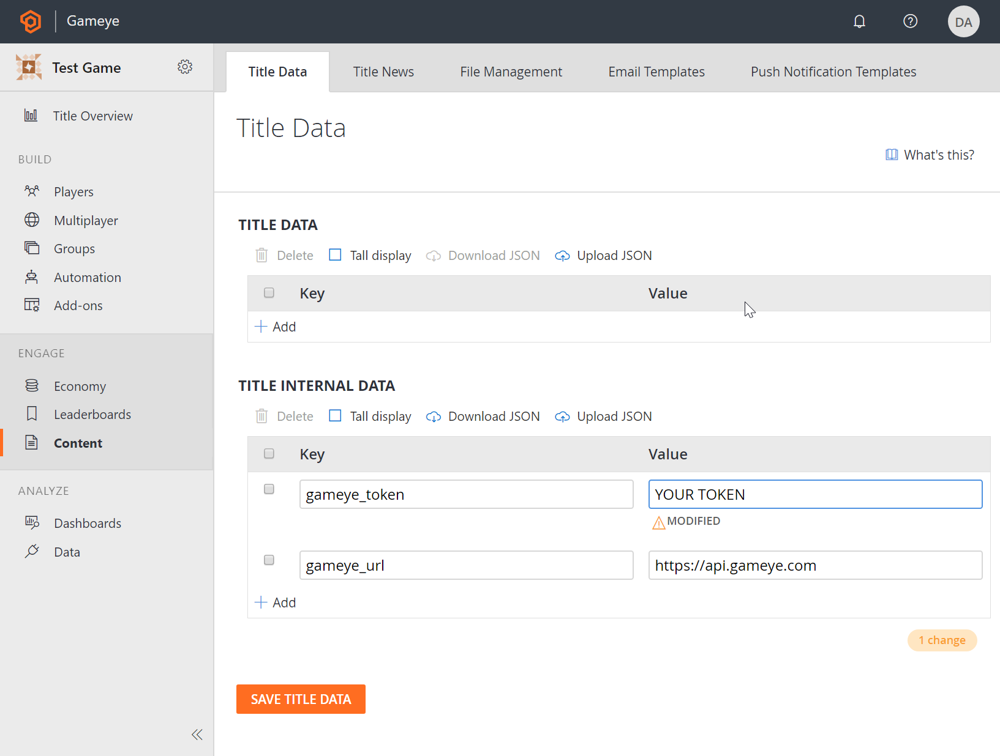
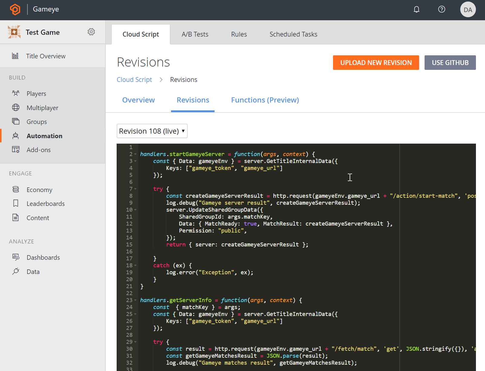

# playfab

## Contents

- Example NodeJS game client in `client`
- Example CloudScript for starting a gameye match in `cloudscript`

## Integration Flow

### CloudScript

In the cloudscript folder is a cloud script that communicates with the Gameye servers and provides information back to the game client.

#### Usage:

- In the PlayFab admin panel, go to Content and add your Gameye access token and the Gameye API URL to the Title Internal Data. These will be hidden from the client, but are needed by the cloud script.

- In Automation -> Cloud Script -> Revisions, copy the content of `script.js`, save and deploy.

- Under Rules, create a new Rule that responds to the event `playfab.matchmaking.match_found`. - Add an Action that executes the cloud script function `matchFound`.

### Game Client

- In the client folder is an example NodeJS client using the Playfab SDK.
